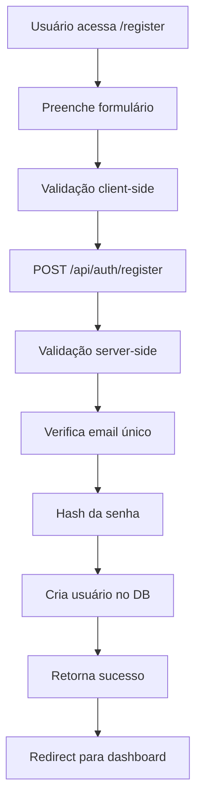
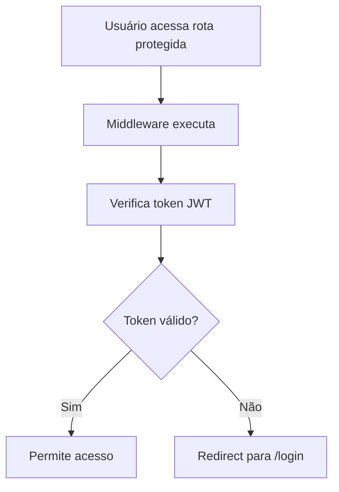

# Sistema de Autenticação

## Visão Geral

O MesaRPG implementa um sistema completo de autenticação usando NextAuth.js, oferecendo registro, login, proteção de rotas e gerenciamento de sessões persistentes.

## Componentes Principais

### 1. Configuração NextAuth
- **Arquivo**: `lib/auth.ts`
- **Provider**: Credentials provider para login customizado
- **Callbacks**: Configuração de JWT e session
- **Páginas**: Login e registro customizadas

### 2. Middleware de Proteção
- **Arquivo**: `middleware.ts`
- **Rotas Protegidas**:
  - `/dashboard` - Acesso ao dashboard de campanhas
  - `/campaign/*` - Acesso às campanhas e funcionalidades do jogo
- **Redirecionamento**: Usuários não autenticados são redirecionados para `/login`

### 3. Páginas de Autenticação

#### Página de Login (`app/login/page.tsx`)
- **Funcionalidades**:
  - Formulário de login com validação
  - Integração com NextAuth
  - Toast notifications para feedback
  - Redirecionamento automático após login
- **Campos**: Email e senha
- **Validação**: Client-side e server-side

#### Página de Registro (`app/register/page.tsx`)
- **Funcionalidades**:
  - Criação de novas contas
  - Validação de dados de entrada
  - Hash de senhas automático
  - Toast notifications
  - Redirecionamento para dashboard após registro
- **Campos**: Nome, email e senha
- **Validação**: Unicidade de email, força da senha

### 4. API de Registro
- **Endpoint**: `POST /api/auth/register`
- **Funcionalidades**:
  - Validação de dados de entrada
  - Verificação de email único
  - Hash de senha com bcrypt
  - Criação de usuário no banco de dados
- **Resposta**: JSON com status e mensagem

## Fluxo de Autenticação

### 1. Registro de Usuário


### 2. Login de Usuário
```mermaid
graph TD
    A[Usuário acessa /login] --> B[Preenche credenciais]
    B --> C[POST /api/auth/[...nextauth]]
    C --> D[Valida credenciais]
    D --> E[Verifica senha]
    E --> F[Cria sessão JWT]
    F --> G[Define cookies]
    G --> H[Redirect para dashboard]
```

### 3. Proteção de Rotas


## Estrutura de Dados

### User Model (Prisma)
```prisma
model User {
  id                    String            @id @default(cuid())
  name                  String
  email                 String            @unique
  password              String
  createdAt             DateTime          @default(now())
  updatedAt             DateTime          @updatedAt
  
  // Relacionamentos
  ownedCampaigns        Campaign[]        @relation("CampaignOwner")
  campaignMemberships   CampaignMember[]
  characters            Character[]
  chatMessages          ChatMessage[]
  uploadedFiles         File[]
}
```

### Session Data
```typescript
interface Session {
  user: {
    id: string
    name: string
    email: string
  }
  expires: string
}
```

## Configuração

### Variáveis de Ambiente
```env
NEXTAUTH_SECRET="your-secret-here"
NEXTAUTH_URL="http://localhost:3000"
```

### NextAuth Configuration
```typescript
export const authOptions: NextAuthOptions = {
  providers: [
    CredentialsProvider({
      name: "credentials",
      credentials: {
        email: { label: "Email", type: "email" },
        password: { label: "Password", type: "password" }
      },
      async authorize(credentials) {
        // Lógica de autenticação
      }
    })
  ],
  pages: {
    signIn: '/login',
    signUp: '/register'
  },
  session: {
    strategy: "jwt"
  },
  callbacks: {
    async jwt({ token, user }) {
      if (user) {
        token.id = user.id
      }
      return token
    },
    async session({ session, token }) {
      if (token) {
        session.user.id = token.id as string
      }
      return session
    }
  }
}
```

## Segurança

### Hash de Senhas
- **Biblioteca**: bcrypt
- **Salt Rounds**: 12
- **Processo**: Hash automático no registro e verificação no login

### JWT Tokens
- **Algoritmo**: HS256
- **Expiração**: Configurável via NextAuth
- **Secret**: Variável de ambiente segura

### Validação de Entrada
- **Client-side**: Validação de formato e campos obrigatórios
- **Server-side**: Validação de unicidade e integridade

## Providers Client-Side

### ClientProviders (`components/providers/client-providers.tsx`)
```typescript
export function ClientProviders({ children }: { children: React.ReactNode }) {
  return (
    <SessionProvider>
      <Toaster />
      {children}
    </SessionProvider>
  )
}
```

### Layout Integration (`app/layout.tsx`)
```typescript
export default function RootLayout({
  children,
}: {
  children: React.ReactNode
}) {
  return (
    <html lang="pt-BR">
      <body className={inter.className}>
        <ClientProviders>
          {children}
        </ClientProviders>
      </body>
    </html>
  )
}
```

## Estados de Autenticação

### Hooks Disponíveis
```typescript
// Para Client Components
import { useSession } from "next-auth/react"

function MyComponent() {
  const { data: session, status } = useSession()
  
  if (status === "loading") return <p>Loading...</p>
  if (status === "unauthenticated") return <p>Access Denied</p>
  
  return <p>Welcome {session?.user?.name}!</p>
}

// Para Server Components
import { getServerSession } from "next-auth/next"
import { authOptions } from "@/lib/auth"

export default async function Page() {
  const session = await getServerSession(authOptions)
  
  if (!session) {
    redirect('/login')
  }
  
  return <div>Hello {session.user.name}</div>
}
```

## Tratamento de Erros

### Erros Comuns
- **Email já cadastrado**: Verificação na API de registro
- **Credenciais inválidas**: Validação no login
- **Sessão expirada**: Redirecionamento automático

### Toast Notifications
```typescript
import { toast } from "sonner"

// Sucesso
toast.success("Login realizado com sucesso!")

// Erro
toast.error("Credenciais inválidas")

// Informação
toast.info("Redirecionando...")
```

## Correções Implementadas

### React Context em Server Components
- **Problema**: Uso de `useSession` em Server Components
- **Solução**: Separação clara entre Server e Client Components
- **Implementação**: `ClientProviders` wrapper para Context

### Middleware de Rotas
- **Problema**: Proteção inconsistente de rotas
- **Solução**: Middleware centralizado com lista de rotas protegidas
- **Implementação**: Verificação JWT automática

## Fluxo de Desenvolvimento

### 1. Configuração Inicial
```bash
# Instalar dependências
npm install next-auth bcryptjs

# Configurar variáveis de ambiente
cp .env.example .env.local
```

### 2. Implementação
```bash
# Criar configuração auth
touch lib/auth.ts

# Criar middleware
touch middleware.ts

# Criar páginas de auth
mkdir app/login app/register
```

### 3. Testes
```bash
# Testar registro
curl -X POST http://localhost:3000/api/auth/register \
  -H "Content-Type: application/json" \
  -d '{"name":"Test","email":"test@test.com","password":"123456"}'

# Testar login
curl -X POST http://localhost:3000/api/auth/signin
```

## Próximos Passos

### Melhorias Futuras
- [ ] OAuth providers (Google, GitHub)
- [ ] Two-factor authentication (2FA)
- [ ] Password reset functionality
- [ ] Email verification
- [ ] Rate limiting para login attempts
- [ ] Audit logs de autenticação

### Integrações
- [ ] Integração com sistemas externos
- [ ] SSO (Single Sign-On)
- [ ] LDAP/Active Directory
- [ ] API keys para acesso programático